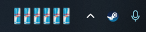

# RedBull Tracker

A Windows taskbar widget to track your Red Bull consumption.



## Features

- **Visual tracking** - See your Red Bull cans displayed in the taskbar
- **Easy interaction** - Right-click to add, left-click to remove
- **Persistent count** - Your count is saved locally
- **Configurable** - Choose between default and sugar-free can styles
- **Starts with Windows** - Always ready when you need it

## Installation

1. Download the latest release from [Releases](https://github.com/user/redbull-tracker/releases)
2. Run `RedBullTracker.exe`
3. The widget will appear in your taskbar

## Usage

- **Right-click** the widget to add a Red Bull
- **Left-click** the widget to remove a Red Bull
- Hover over the widget to see your current count

## Configuration

Configuration is stored in `%LOCALAPPDATA%\RedBullTracker\config.json`:

```json
{
  "canType": "default",
  "apiUrl": null,
  "useOnlineMode": false,
  "startWithWindows": true
}
```

| Option | Description | Values |
|--------|-------------|--------|
| `canType` | Which can image to display | `"default"`, `"sugarfree"` |
| `apiUrl` | API URL for online mode (future) | URL string or `null` |
| `useOnlineMode` | Enable online sync (future) | `true`, `false` |
| `startWithWindows` | Launch on Windows startup | `true`, `false` |

## Building from Source

This is a monorepo. The widget lives in `apps/widget/`; the API will live in `apps/api/` (in progress).

```bash
# Clone with submodules
git clone --recursive https://github.com/user/redbull-tracker.git
cd redbull-tracker

# Build
dotnet build -p:Platform=x64

# Run
dotnet run --project apps/widget/RedBullTracker.csproj -p:Platform=x64
```

## Requirements

- Windows 10/11
- .NET 8.0 Runtime (included in self-contained builds)

## License

MIT
